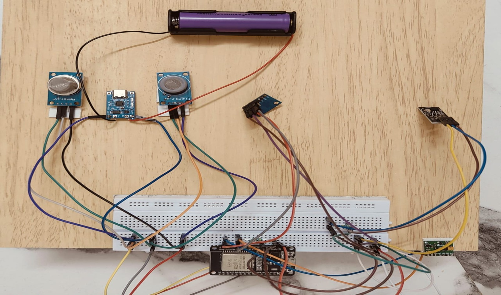

# Integrated Worker Safety Monitoring System

##  Overview
IoT-based wearable system for monitoring worker health, gas exposure, and fatigue in real time.

##  Features
- Heart Rate & SpO2 Monitoring
- Gas Detection (MQ-7, MQ-135)
- Fatigue Detection (MPU6050)
- Alert System using LED/Buzzer

##  Tech Stack
- ESP32
- Embedded C
- Sensors (MAX30102, MPU6050, MQ series)
- Flask (optional backend)

##  Project Image

##  Applications
- Industrial safety
- Mining
- Construction sites

##  Author
Gowtham
